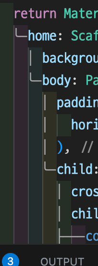

# toonflix

flutter tutorial

## 설치

다음 명령어로 프로젝트를 시작할 수 있습니다.
```bash
flutter create [프로젝트명]
```

- vscode 에서 dart 와 flutter extension 을 설치해줍니다.
- flutter 의 메인 파일은 `/lib/main.dart` 에 있습니다.

## Widget

> 플러트는 위젯을 쌓아서 앱을 구성합니다.

- 위젯은 class 입니다.
- 위젯을 만들 때, flutter SDK 에 있는 3개의 core Widget 중 하나를 상속 받아야 합니다.
- 모든 위젯은 build 메소드를 구현해야 합니다. 플러터는 이 build 메소드가 리턴하는 값을 띄워줍니다.
- ui 는 크게 Material(구글) 과 Cupertino (애플) 디자인이 있습니다.

### StatelessWidget


```dart
import 'package:flutter/material.dart';

void main() {
  runApp(App());
}

class App extends StatelessWidget {
  @override
  Widget build(BuildContext context) {
    return MaterialApp( // Material 은 구글ui 입니다.
      home: Scaffold(
        appBar: AppBar(
          title: Text('Hello flutter!'),
        ),
        body: Center(
          child: Text('Hello world!'),
        ),
      ),
    );
  }
}
```

## vscode settings

`settings.json` 에 다음 속성을 추가합니다.

```json
"editor.codeActionsOnSave": {
  "source.fixAll": true,
},
"dart.previewFlutterUiGuides": true,
```

- 저장할 때마다 `const` 를 붙여줍니다.
- 부모가 무엇인지 알려주는 줄을 만들어줍니다.



> error lens 익스텐션 설치도 추천


## 챌린지
- currency_card 가 order 값을 받아고, 그 값으로 offset 을 계산하게 바꾸기

lib/main.dart
```dart
import 'package:flutter/material.dart';
import 'package:toonflix/widgets/button.dart';
import 'package:toonflix/widgets/currency_card.dart';
void main() {
  runApp(const App());
}
class App extends StatelessWidget {
  const App({super.key});
  @override
  Widget build(BuildContext context) {
    return MaterialApp(
      home: Scaffold(
        backgroundColor: const Color(0xFF181818),
        body: SingleChildScrollView(
          child: Padding(
            padding: const EdgeInsets.symmetric(
              horizontal: 20,
            ),
            child: Column(
              crossAxisAlignment: CrossAxisAlignment.start,
              children: [
                const SizedBox(
                  height: 80,
                ),
                const Row(
                  mainAxisAlignment: MainAxisAlignment.end,
                  children: [
                    Column(
                      crossAxisAlignment: CrossAxisAlignment.end,
                      children: [
                        Text(
                          'Hey, Selena',
                          style: TextStyle(
                            color: Colors.white,
                            fontSize: 28,
                            fontWeight: FontWeight.w800,
                          ),
                        ),
                        Text(
                          'Welcome back',
                          style: TextStyle(
                            color: Color.fromRGBO(255, 255, 255, 0.8),
                            fontSize: 18,
                          ),
                        ),
                      ],
                    )
                  ],
                ),
                const SizedBox(
                  height: 70,
                ),
                Text(
                  'Total Balance',
                  style: TextStyle(
                    fontSize: 22,
                    color: Colors.white.withOpacity(0.8),
                  ),
                ),
                const SizedBox(
                  height: 5,
                ),
                const Text(
                  '\$5 194 482',
                  style: TextStyle(
                    fontSize: 48,
                    fontWeight: FontWeight.w600,
                    color: Colors.white,
                  ),
                ),
                const SizedBox(
                  height: 30,
                ),
                const Row(
                  mainAxisAlignment: MainAxisAlignment.spaceBetween,
                  children: [
                    Button(
                      text: 'Transfer',
                      bgColor: Color(0xFFF1B33B),
                      textColor: Colors.black,
                    ),
                    Button(
                      text: 'Request',
                      bgColor: Color(0xFF1F2123),
                      textColor: Colors.white,
                    ),
                  ],
                ),
                const SizedBox(
                  height: 50,
                ),
                Row(
                  crossAxisAlignment: CrossAxisAlignment.end,
                  mainAxisAlignment: MainAxisAlignment.spaceBetween,
                  children: [
                    const Text(
                      'Wallets',
                      style: TextStyle(
                        color: Colors.white,
                        fontSize: 36,
                        fontWeight: FontWeight.w600,
                      ),
                    ),
                    Text(
                      'View All',
                      style: TextStyle(
                        color: Colors.white.withOpacity(0.8),
                        fontSize: 18,
                      ),
                    ),
                  ],
                ),
                const SizedBox(
                  height: 20,
                ),
                const CurrencyCard(
                  name: 'Euro',
                  code: 'EUR',
                  amount: '6 428',
                  icon: Icons.euro_rounded,
                  isInverted: false,
                ),
                Transform.translate(
                  offset: const Offset(0, -20),
                  child: const CurrencyCard(
                    name: 'Bitcoin',
                    code: 'BTC',
                    amount: '9 785',
                    icon: Icons.currency_bitcoin,
                    isInverted: true,
                  ),
                ),
                Transform.translate(
                  offset: const Offset(0, -40),
                  child: const CurrencyCard(
                    name: 'Dollar',
                    code: 'USD',
                    amount: '428',
                    icon: Icons.monetization_on_outlined,
                    isInverted: false,
                  ),
                ),
              ],
            ),
          ),
        ),
      ),
    );
  }
}
```

lib/widgets/button.dart
```dart
import 'package:flutter/material.dart';

class Button extends StatelessWidget {
  final String text;
  final Color bgColor;
  final Color textColor;

  const Button({
    super.key,
    required this.text,
    required this.bgColor,
    required this.textColor,
  });

  @override
  Widget build(BuildContext context) {
    return Container(
      decoration: BoxDecoration(
        color: bgColor,
        borderRadius: BorderRadius.circular(45),
      ),
      child: Padding(
        padding: const EdgeInsets.symmetric(
          vertical: 20,
          horizontal: 50,
        ),
        child: Text(
          text,
          style: TextStyle(
            color: textColor,
            fontSize: 20,
          ),
        ),
      ),
    );
  }
}

```
lib/widgets/currency_card.dart
```dart
import 'package:flutter/material.dart';

class CurrencyCard extends StatelessWidget {
  final String name, code, amount;
  final IconData icon;
  final bool isInverted;

  final _blackColor = const Color(0xFF1F2123);

  const CurrencyCard({
    super.key,
    required this.name,
    required this.code,
    required this.amount,
    required this.icon,
    required this.isInverted,
  });

  @override
  Widget build(BuildContext context) {
    return Container(
      clipBehavior: Clip.hardEdge,
      decoration: BoxDecoration(
        color: isInverted ? Colors.white : _blackColor,
        borderRadius: BorderRadius.circular(25),
      ),
      child: Padding(
        padding: const EdgeInsets.all(30),
        child: Row(
          mainAxisAlignment: MainAxisAlignment.spaceBetween,
          children: [
            Column(
              crossAxisAlignment: CrossAxisAlignment.start,
              children: [
                Text(
                  name,
                  style: TextStyle(
                    color: isInverted ? _blackColor : Colors.white,
                    fontSize: 32,
                    fontWeight: FontWeight.w600,
                  ),
                ),
                const SizedBox(
                  height: 20,
                ),
                Row(
                  children: [
                    Text(
                      amount,
                      style: TextStyle(
                        color: isInverted ? _blackColor : Colors.white,
                        fontSize: 20,
                      ),
                    ),
                    const SizedBox(
                      width: 5,
                    ),
                    Text(
                      code,
                      style: TextStyle(
                        color: isInverted
                            ? _blackColor
                            : Colors.white.withOpacity(0.8),
                        fontSize: 20,
                      ),
                    ),
                  ],
                )
              ],
            ),
            Transform.scale(
              scale: 2.2,
              child: Transform.translate(
                offset: const Offset(
                  -5,
                  12,
                ),
                child: Icon(
                  icon,
                  color: isInverted ? _blackColor : Colors.white,
                  size: 88,
                ),
              ),
            )
          ],
        ),
      ),
    );
  }
}

```


