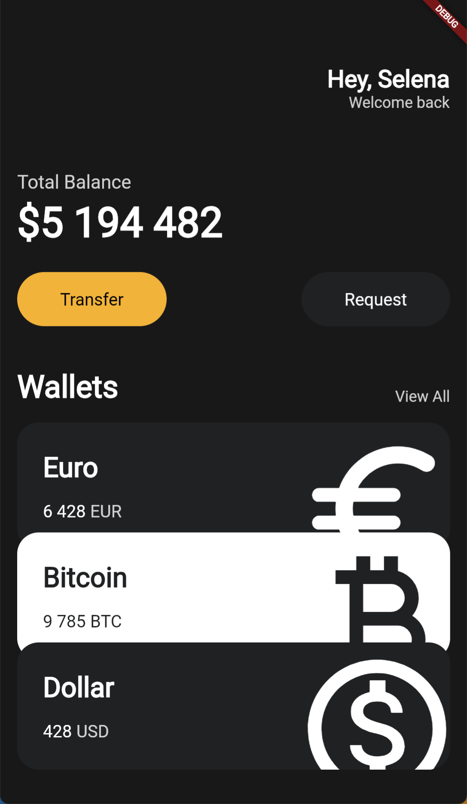
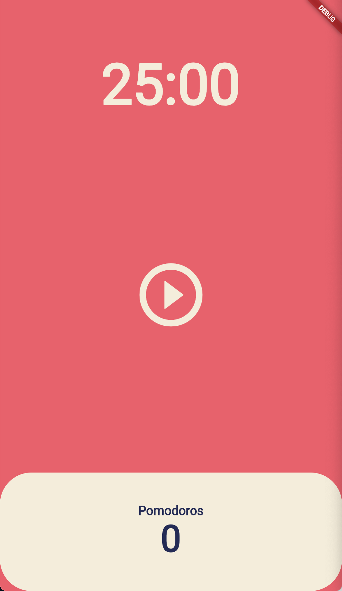

# toonflix

flutter tutorial

## 설치

다음 명령어로 프로젝트를 시작할 수 있습니다.
```bash
flutter create [프로젝트명]
```

- vscode 에서 dart 와 flutter extension 을 설치해줍니다.
- flutter 의 메인 파일은 `/lib/main.dart` 에 있습니다.

## Widget

> 플러트는 위젯을 쌓아서 앱을 구성합니다.

- 위젯은 class 입니다.
- 위젯을 만들 때, flutter SDK 에 있는 3개의 core Widget 중 하나를 상속 받아야 합니다.
- 모든 위젯은 build 메소드를 구현해야 합니다. 플러터는 이 build 메소드가 리턴하는 값을 띄워줍니다.
- ui 는 크게 Material(구글) 과 Cupertino (애플) 디자인이 있습니다.

### StatelessWidget


```dart
import 'package:flutter/material.dart';

void main() {
  runApp(App());
}

class App extends StatelessWidget {
  @override
  Widget build(BuildContext context) {
    return MaterialApp( // Material 은 구글ui 입니다.
      home: Scaffold(
        appBar: AppBar(
          title: Text('Hello flutter!'),
        ),
        body: Center(
          child: Text('Hello world!'),
        ),
      ),
    );
  }
}
```

## vscode settings

`settings.json` 에 다음 속성을 추가합니다.

```json
"editor.codeActionsOnSave": {
  "source.fixAll": true,
},
"dart.previewFlutterUiGuides": true,
```

- 저장할 때마다 `const` 를 붙여줍니다.
- 부모가 무엇인지 알려주는 줄을 만들어줍니다.


> error lens 익스텐션 설치도 추천


## 챌린지
- currency_card 가 order 값을 받아고, 그 값으로 offset 을 계산하게 바꾸기

lib/main.dart
```dart
import 'package:flutter/material.dart';
import 'package:toonflix/widgets/button.dart';
import 'package:toonflix/widgets/currency_card.dart';
void main() {
  runApp(const App());
}
class App extends StatelessWidget {
  const App({super.key});
  @override
  Widget build(BuildContext context) {
    return MaterialApp(
      home: Scaffold(
        backgroundColor: const Color(0xFF181818),
        body: SingleChildScrollView(
          child: Padding(
            padding: const EdgeInsets.symmetric(
              horizontal: 20,
            ),
            child: Column(
              crossAxisAlignment: CrossAxisAlignment.start,
              children: [
                const SizedBox(
                  height: 80,
                ),
                const Row(
                  mainAxisAlignment: MainAxisAlignment.end,
                  children: [
                    Column(
                      crossAxisAlignment: CrossAxisAlignment.end,
                      children: [
                        Text(
                          'Hey, Selena',
                          style: TextStyle(
                            color: Colors.white,
                            fontSize: 28,
                            fontWeight: FontWeight.w800,
                          ),
                        ),
                        Text(
                          'Welcome back',
                          style: TextStyle(
                            color: Color.fromRGBO(255, 255, 255, 0.8),
                            fontSize: 18,
                          ),
                        ),
                      ],
                    )
                  ],
                ),
                const SizedBox(
                  height: 70,
                ),
                Text(
                  'Total Balance',
                  style: TextStyle(
                    fontSize: 22,
                    color: Colors.white.withOpacity(0.8),
                  ),
                ),
                const SizedBox(
                  height: 5,
                ),
                const Text(
                  '\$5 194 482',
                  style: TextStyle(
                    fontSize: 48,
                    fontWeight: FontWeight.w600,
                    color: Colors.white,
                  ),
                ),
                const SizedBox(
                  height: 30,
                ),
                const Row(
                  mainAxisAlignment: MainAxisAlignment.spaceBetween,
                  children: [
                    Button(
                      text: 'Transfer',
                      bgColor: Color(0xFFF1B33B),
                      textColor: Colors.black,
                    ),
                    Button(
                      text: 'Request',
                      bgColor: Color(0xFF1F2123),
                      textColor: Colors.white,
                    ),
                  ],
                ),
                const SizedBox(
                  height: 50,
                ),
                Row(
                  crossAxisAlignment: CrossAxisAlignment.end,
                  mainAxisAlignment: MainAxisAlignment.spaceBetween,
                  children: [
                    const Text(
                      'Wallets',
                      style: TextStyle(
                        color: Colors.white,
                        fontSize: 36,
                        fontWeight: FontWeight.w600,
                      ),
                    ),
                    Text(
                      'View All',
                      style: TextStyle(
                        color: Colors.white.withOpacity(0.8),
                        fontSize: 18,
                      ),
                    ),
                  ],
                ),
                const SizedBox(
                  height: 20,
                ),
                const CurrencyCard(
                  name: 'Euro',
                  code: 'EUR',
                  amount: '6 428',
                  icon: Icons.euro_rounded,
                  isInverted: false,
                ),
                Transform.translate(
                  offset: const Offset(0, -20),
                  child: const CurrencyCard(
                    name: 'Bitcoin',
                    code: 'BTC',
                    amount: '9 785',
                    icon: Icons.currency_bitcoin,
                    isInverted: true,
                  ),
                ),
                Transform.translate(
                  offset: const Offset(0, -40),
                  child: const CurrencyCard(
                    name: 'Dollar',
                    code: 'USD',
                    amount: '428',
                    icon: Icons.monetization_on_outlined,
                    isInverted: false,
                  ),
                ),
              ],
            ),
          ),
        ),
      ),
    );
  }
}
```

lib/widgets/button.dart
```dart
import 'package:flutter/material.dart';

class Button extends StatelessWidget {
  final String text;
  final Color bgColor;
  final Color textColor;

  const Button({
    super.key,
    required this.text,
    required this.bgColor,
    required this.textColor,
  });

  @override
  Widget build(BuildContext context) {
    return Container(
      decoration: BoxDecoration(
        color: bgColor,
        borderRadius: BorderRadius.circular(45),
      ),
      child: Padding(
        padding: const EdgeInsets.symmetric(
          vertical: 20,
          horizontal: 50,
        ),
        child: Text(
          text,
          style: TextStyle(
            color: textColor,
            fontSize: 20,
          ),
        ),
      ),
    );
  }
}

```
lib/widgets/currency_card.dart
```dart
import 'package:flutter/material.dart';

class CurrencyCard extends StatelessWidget {
  final String name, code, amount;
  final IconData icon;
  final bool isInverted;

  final _blackColor = const Color(0xFF1F2123);

  const CurrencyCard({
    super.key,
    required this.name,
    required this.code,
    required this.amount,
    required this.icon,
    required this.isInverted,
  });

  @override
  Widget build(BuildContext context) {
    return Container(
      clipBehavior: Clip.hardEdge,
      decoration: BoxDecoration(
        color: isInverted ? Colors.white : _blackColor,
        borderRadius: BorderRadius.circular(25),
      ),
      child: Padding(
        padding: const EdgeInsets.all(30),
        child: Row(
          mainAxisAlignment: MainAxisAlignment.spaceBetween,
          children: [
            Column(
              crossAxisAlignment: CrossAxisAlignment.start,
              children: [
                Text(
                  name,
                  style: TextStyle(
                    color: isInverted ? _blackColor : Colors.white,
                    fontSize: 32,
                    fontWeight: FontWeight.w600,
                  ),
                ),
                const SizedBox(
                  height: 20,
                ),
                Row(
                  children: [
                    Text(
                      amount,
                      style: TextStyle(
                        color: isInverted ? _blackColor : Colors.white,
                        fontSize: 20,
                      ),
                    ),
                    const SizedBox(
                      width: 5,
                    ),
                    Text(
                      code,
                      style: TextStyle(
                        color: isInverted
                            ? _blackColor
                            : Colors.white.withOpacity(0.8),
                        fontSize: 20,
                      ),
                    ),
                  ],
                )
              ],
            ),
            Transform.scale(
              scale: 2.2,
              child: Transform.translate(
                offset: const Offset(
                  -5,
                  12,
                ),
                child: Icon(
                  icon,
                  color: isInverted ? _blackColor : Colors.white,
                  size: 88,
                ),
              ),
            )
          ],
        ),
      ),
    );
  }
}

```




## stateful widget
> stateless widget 은 build 메서드를 통해 ui 를 출력하는 것이고, stateful widget 은 상태에 따라 ui가 변하게 됩니다.

stateful widget 은 두 부분으로 나눕니다.
- state가 없을 때
- state가 있을 때

### life cycle

`initState` 함수와 `dispose` 함수를 사용하면, mount 와 unmount 일 때 코드를 실행할 수 있습니다.

## 포모도로

lib/main.dart
```dart
import 'package:flutter/material.dart';
import 'package:toonflix/screens/home_screen.dart';

void main() {
  runApp(const App());
}

class App extends StatelessWidget {
  const App({super.key});

  @override
  Widget build(BuildContext context) {
    return MaterialApp(
      theme: ThemeData(
        textTheme: const TextTheme(
          displayLarge: TextStyle(
            color: Color(0xFF232B55),
          ),
        ),
        cardColor: const Color(0xFFF4EDDB),
        colorScheme: const ColorScheme(
            brightness: Brightness.dark,
            error: Colors.deepOrange,
            primary: Colors.blue,
            onPrimary: Colors.black,
            secondary: Colors.black12,
            onSecondary: Colors.black45,
            onError: Colors.black45,
            background: Color(0xFFE7626C),
            onBackground: Colors.black87,
            surface: Colors.black45,
            onSurface: Colors.black38,

            ),
      ),
      home: const HomeScreen(),
    );
  }
}
```

lib/screens/home_screen.dart
```dart
import 'dart:async';
import 'package:flutter/material.dart';

class HomeScreen extends StatefulWidget {
  const HomeScreen({super.key});

  @override
  State<HomeScreen> createState() => _HomeScreenState();
}

class _HomeScreenState extends State<HomeScreen> {
  static const twentyFiveMinutes = 1500;
  int totalSeconds = twentyFiveMinutes;
  bool isRunning = false;
  int totalPomodoros = 0;
  late Timer timer;

  void onTick(Timer timer) {
    if (totalSeconds == 0) {
      setState(() {
        totalPomodoros = totalPomodoros + 1;
        isRunning = false;
        totalSeconds = twentyFiveMinutes;
      });
      timer.cancel();
    } else {
      setState(() {
        totalSeconds = totalSeconds - 1;
      });
    }
  }

  void onStartPressed() {
    timer = Timer.periodic(
      const Duration(seconds: 1),
      onTick,
    );
        setState(() {
      isRunning = true;
    });
  }

  void onPausePressed() {
    timer.cancel();
    setState(() {
      isRunning = false;
    });
  }
  String format(int seconds) {
    var duration = Duration(seconds: seconds);
    return duration.toString().split(".").first.substring(2, 7);
  }
  @override
  Widget build(BuildContext context) {
    return Scaffold(
      backgroundColor: Theme.of(context).colorScheme.background,
      body: Column(
        children: [
          Flexible(
            flex: 1,
            child: Container(
              alignment: Alignment.bottomCenter,
              child: Text(
                format(totalSeconds),
                style: TextStyle(
                  color: Theme.of(context).cardColor,
                  fontSize: 89,
                  fontWeight: FontWeight.w600,
                ),
              ),
            ),
          ),
          Flexible(
            flex: 3,
            child: Center(
              child: IconButton(
                iconSize: 120,
                color: Theme.of(context).cardColor,
                onPressed: isRunning ? onPausePressed : onStartPressed,
                icon: Icon(isRunning
                    ? Icons.pause_circle_outline
                    : Icons.play_circle_outline),
              ),
            ),
          ),
          Flexible(
            flex: 1,
            child: Row(
              children: [
                Expanded(
                  child: Container(
                    decoration: BoxDecoration(
                      color: Theme.of(context).cardColor,
                      borderRadius: BorderRadius.circular(50),
                    ),
                    child: Column(
                      mainAxisAlignment: MainAxisAlignment.center,
                      children: [
                        Text(
                          'Pomodoros',
                          style: TextStyle(
                            fontSize: 20,
                            fontWeight: FontWeight.w600,
                            color:
                                Theme.of(context).textTheme.displayLarge!.color,
                          ),
                        ),
                        Text(
                          '$totalPomodoros',
                          style: TextStyle(
                            fontSize: 58,
                            fontWeight: FontWeight.w600,
                            color:
                                Theme.of(context).textTheme.displayLarge!.color,
                          ),
                        ),
                      ],
                    ),
                  ),
                ),
              ],
            ),
          )
        ],
      ),
    );
  }
}
```



챌린지
1. play/pause 기능 외에 reset 기능을 추가하기

## toonflix

> 패키지는 `https://pub.dev` 에서 찾을 수 있습니다.

http 요청을 하려면 `http` 라이브러리를 설치하면 됩니다 : https://pub.dev/packages/http

```bash
$ dart pub add http
```

```bash
$ flutter pub add http
```

### 비동기
javascript 처럼 async-await 를 사용할 수 있다.

```dart
static Future<List<WebtoonModel>> getTodaysToons() async {
    List<WebtoonModel> webtoonInstances = [];
    final url = Uri.parse('$baseUrl/$today');
    final response = await http.get(url);
    if (response.statusCode == 200) {
      final webtoons = jsonDecode(response.body);
      for (var webtoon in webtoons) {
        final instance = WebtoonModel.fromJson(webtoon);
        webtoonInstances.add(instance);
      }
      return webtoonInstances;
    }
    throw Error();
  }
```

### url_launcher

https://pub.dev/packages/url_launcher


> `url_launcher` 를 사용하면 플러터에서 브라우저를 열수도 있습니다.

### shared_preferences

https://pub.dev/packages/shared_preferences

> 상태관리를 할 수 있습니다.